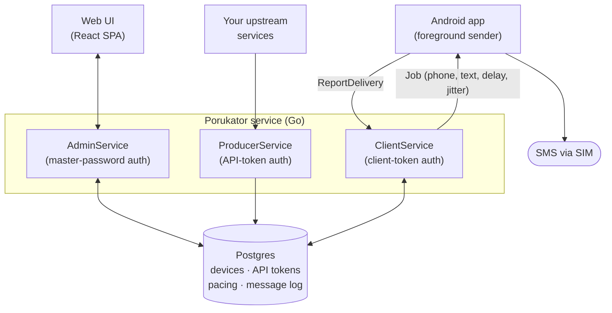
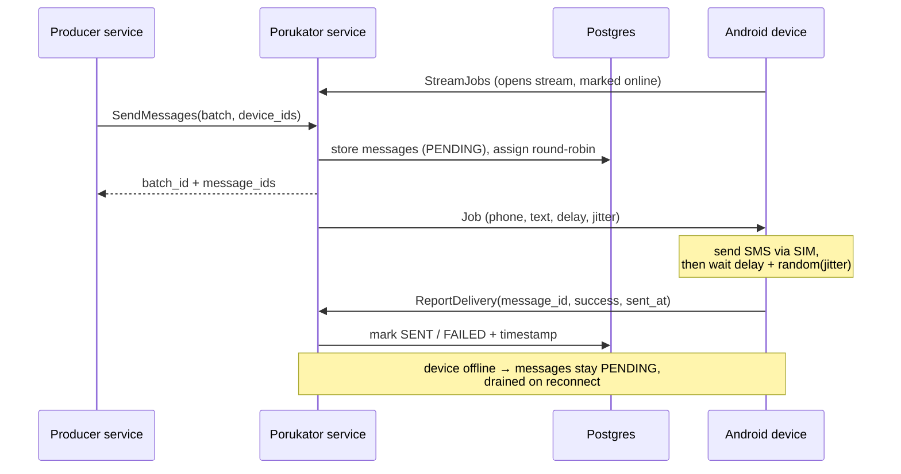

# Porukator

Porukator is a **self-hosted SMS gateway** that replaces commercial providers
(such as Twilio) by using your own Android phones as the SMS transport. Your
services hand Porukator a list of `(phone number, message)` jobs together with
the set of devices to send from; the service balances those messages across the
devices, and each device sends them as real SMS from its SIM and reports
delivery back.

It is a small, self-contained monorepo: a protobuf contract, a Go service, a
React web UI, and an Android app.

## Features

- **Phones as SMS senders** — no third-party SMS provider; messages go out from
  the SIMs of devices you control.
- **Multiple devices, balanced** — submit a batch plus the devices to use, and
  Porukator distributes the messages round-robin across them.
- **Send pacing** — a configurable delay plus random jitter between each SMS a
  device sends, to spread traffic out.
- **Live device status** — the web UI shows which devices are online (connected
  and waiting for messages) and when each was last seen.
- **Simple device onboarding** — add a device in the UI and pair it by typing
  the host + token into the app, or by scanning a generated QR code.
- **Three clear access surfaces** — a single master password for the admin UI,
  per-service API tokens for producers, and per-device access tokens for the
  phones.
- **Durable, auditable log** — every message is stored in Postgres with its
  phone number, content, status, and timestamps for when it was received and
  when it was sent.
- **Resilient delivery** — messages for an offline device are held and delivered
  when it reconnects; dispatch is exactly-once.

## Architecture

Porukator is one protobuf contract exposing three services, consumed by three
clients:

### Components

- **Contract (`proto/`)** — a single `porukator.v1` protobuf file defines the
  message types and the three services. All clients are generated from it
  (Go, TypeScript, Kotlin/Java).

- **Service (`cmd/`, `internal/`)** — a Go server speaking Connect (gRPC-compatible)
  over HTTP. It hosts:
  - `AdminService` — used by the web UI to manage devices, API tokens, pacing,
    and to read the message log.
  - `ProducerService` — used by your other services to list devices and submit
    messages.
  - `ClientService` — used by the Android app: a server stream the service
    pushes jobs onto, plus a call the app uses to report each send.

  It keeps an in-memory registry of connected devices (the source of the
  "online" flag) and persists everything else in Postgres.

- **Web UI (`webui/`)** — a React single-page app. Access is gated by the single
  master password set at service start. It manages devices (with online status
  and QR pairing), API tokens, pacing settings, and shows the message log.

- **Android app (`android/`)** — a Kotlin app. It is paired with connection
  parameters (host + access token, typed or scanned from a QR code) and runs a
  foreground service that holds the job stream open, sends each pushed SMS with
  the configured delay + jitter, and reports the outcome back.

### How a message flows

## Tech stack

- **Service** — Go, Connect RPC, Postgres (pgx + sqlc + golang-migrate), Viper
  config, zap logging.
- **Web UI** — Vite, React, TypeScript, Connect-Query + TanStack Query,
  shadcn/ui + Tailwind, Zustand. Packages managed with pnpm.
- **Android** — Kotlin, Jetpack Compose, Connect-Kotlin, CameraX + ML Kit (QR
  scanning), DataStore.
- **Contract** — Protocol Buffers, generated with Buf.

## Development requirements

- **Go 1.25+**
- **Buf** (protobuf generation) and **just** (task runner)
- **Postgres** (or Docker, to run it via `docker compose`)
- **Node.js + pnpm** for the web UI
- **Android SDK + JDK 17** (Android Studio recommended) for the app; SMS sending
  requires a real device with a SIM

See [`AGENTS.md`](AGENTS.md) for build, run, and code-generation commands for each
component.

## A note on AI-assisted development

This project is developed with the assistance of AI tooling.

## Author & license

Authored by **Dušan Simić**.

Licensed under the BSD 2-Clause License — see [`LICENSE`](LICENSE).
